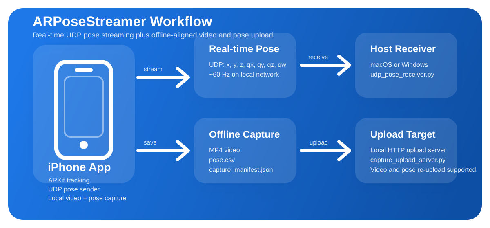

# ARPoseStreamer


ARPoseStreamer is a lightweight iPhone ARKit app and cross-platform UDP receiver for streaming relative camera pose to a host machine.



It is built for robotics, teleoperation, computer vision, and rapid lab experiments where you want:

- no rendering stack
- no 3D scene content or heavy rendering logic
- a simple iPhone-to-host pose stream
- easy debugging on macOS or Windows
- live camera preview background in the app

## At A Glance

```text
iPhone (ARKit)
    |
    |  UDP pose packets
    |  seq, time, x, y, z, qx, qy, qz, qw
    v
Mac / Windows receiver
    |
    +--> terminal inspection
    +--> CSV logging
    +--> custom robotics / CV pipeline
```

## Table Of Contents

- [What It Does](#what-it-does)
- [Why This Repo Exists](#why-this-repo-exists)
- [Highlights](#highlights)
- [Quick Start](#quick-start)
- [Sample Receiver Output](#sample-receiver-output)
- [Documentation](#documentation)
- [Repository Structure](#repository-structure)
- [Packet Format](#packet-format)
- [iPhone Installation Model](#iphone-installation-model)
- [Notes For Robotics / UMI-Style Pipelines](#notes-for-robotics--umi-style-pipelines)
- [FAQ](#faq)
- [Contributing](#contributing)
- [Code of Conduct](#code-of-conduct)
- [Repository Metadata](#repository-metadata)
- [License](#license)

## What It Does

ARPoseStreamer runs ARKit world tracking on an iPhone, converts the pose into a compact packet, and streams it over UDP to a receiver on your laptop or workstation.

Each packet includes:

- sequence number
- sender timestamp
- position: `x, y, z`
- orientation quaternion: `qx, qy, qz, qw`

Default frame convention:

- right-handed
- `Z-up`

## Why This Repo Exists

Many public iPhone pose streaming examples send large transforms or depend on heavier networking stacks. This repository is intentionally smaller and easier to adapt for lab use.

It is especially useful when you want a clean building block for:

- robot teleoperation pipelines
- quick ARKit pose capture
- UMI-style or VIO-style experiments
- custom downstream receivers in Python, ROS2, or C++

## Highlights

- ARKit world tracking
- resettable relative origin
- 60 Hz oriented streaming pipeline
- UDP output to a configurable host IP on port `5555`
- HTTP upload to a configurable host IP and upload port
- compact pose packets
- cross-platform Python receiver
- local video recording to the app Documents folder
- settings panel for receiver and export configuration
- hidden side menu for operational actions
- capture history with renaming and re-upload prompts
- 5-second relative 3D trajectory view
- local pose CSV + manifest export for offline upload
- SwiftUI control panel on iPhone
- XcodeGen project spec included

## Quick Start

### Receiver

On macOS:

```bash
python3 udp_pose_receiver.py --host 0.0.0.0 --port 5555 --encoding binary
```

or:

```bash
sh run_receiver_mac.sh
```

On Windows:

```powershell
py udp_pose_receiver.py --host 0.0.0.0 --port 5555 --encoding binary
```

or:

```powershell
powershell -ExecutionPolicy Bypass -File .\run_receiver_windows.ps1
```

Optional packet logging:

```bash
python3 udp_pose_receiver.py --encoding binary --csv-log logs/pose.csv
```

For real uploads on macOS:

```bash
python3 capture_upload_server.py --host 0.0.0.0 --port 8000
```

### Find The Host IP

On macOS:

```bash
ipconfig getifaddr en0
```

On Windows:

```powershell
ipconfig
```

Use the IPv4 address of the machine running the receiver.

For Windows uploads:

```powershell
py capture_upload_server.py --host 0.0.0.0 --port 8000
```

### Install The iPhone App

Follow:

- [INSTALL_IPHONE_APP.md](INSTALL_IPHONE_APP.md)

Short version:

1. Install Xcode on a Mac
2. Install XcodeGen
3. Run `xcodegen generate`
4. Open the generated project
5. Choose your Apple signing team
6. Build to a connected iPhone

### Start Streaming

On the iPhone:

1. Open the app
2. Use the side menu button to open settings
3. Enter the receiver IP and choose the receiver OS
4. Start streaming or recording from the side menu
5. Allow:
   - camera access
   - local network access

The app opens with a live AR camera background, and the main dashboard overlays status, coordinates, and the recent 3D trajectory.

If a host is reachable, pose is streamed in real time. If you are not connected, the app still saves pose logs locally so they can be exported later.
Multiple recording or streaming segments are saved as separate capture records, named by time by default.
For real file uploads, run the HTTP upload server on the host machine and use the `Past Records` page inside the app.

### Verify

The receiver should show:

- increasing sequence numbers
- near-zero drop count on a stable LAN
- roughly 60 FPS receive rate
- live pose values

Note:

`approx_lat` is only meaningful when the iPhone and receiver clocks are reasonably synchronized.

Recorded videos are stored in the app Documents directory. With file sharing enabled, they can be accessed later through Files or Finder.
Pose data is also saved as CSV plus a JSON manifest, so offline capture sessions can be uploaded later.

## Sample Receiver Output

```text
192.168.1.15:53318 seq=   128 drop=  0 approx_lat=  14.72ms fps= 59.84
x=+0.0124 y=-0.0317 z=+0.8421 qx=+0.0021 qy=-0.7063 qz=+0.0064 qw=+0.7079
```

What you usually want to see:

- `seq` keeps increasing
- `drop` stays near zero on a stable network
- `fps` stays close to `60`
- pose values change smoothly as the phone moves

## Documentation

Detailed docs:

- [Install the iPhone app](INSTALL_IPHONE_APP.md)
- [Setup guide](docs/SETUP.md)
- [Architecture overview](docs/ARCHITECTURE.md)
- [Packet protocol](docs/PROTOCOL.md)

## Repository Structure

- `ARPoseUDPSender.swift`: ARKit + UDP sender core
- `ARPositionApp.swift`: SwiftUI app entry
- `ContentView.swift`: iPhone UI
- `AppSettingsView.swift`: settings sheet for receiver and export options
- `CaptureHistoryView.swift`: past records, rename, and re-upload UI
- `CaptureLibraryStore.swift`: persistent metadata for all capture sessions
- `CaptureUploadService.swift`: HTTP upload client for stored captures
- `capture_upload_server.py`: cross-platform HTTP upload server for macOS/Windows
- `run_upload_server_mac.sh`: macOS helper launcher for uploads
- `run_upload_server_windows.ps1`: Windows helper launcher for uploads
- `PositionViewModel.swift`: app state and sender wiring
- `PoseDataSessionRecorder.swift`: local pose CSV + manifest recorder
- `Assets.xcassets`: app icon resources
- `Info.plist`: iOS permission strings
- `project.yml`: XcodeGen project spec
- `udp_pose_receiver.py`: Python UDP receiver for macOS and Windows
- `run_receiver_mac.sh`: macOS helper launcher
- `run_receiver_windows.ps1`: Windows helper launcher
- `INSTALL_IPHONE_APP.md`: iPhone installation guide
- `ARSessionVideoRecorder.swift`: local MP4 recording helper

## Packet Format

Default encoding is binary UDP, little-endian.

Binary layout:

1. `sequence` as `UInt32`
2. `sender_time` as `Float64`
3. `x` as `Float32`
4. `y` as `Float32`
5. `z` as `Float32`
6. `qx` as `Float32`
7. `qy` as `Float32`
8. `qz` as `Float32`
9. `qw` as `Float32`

Total packet size:

```text
40 bytes
```

CSV mode is available for debugging:

```text
sequence,sender_time,x,y,z,qx,qy,qz,qw
```

## iPhone Installation Model

This repository ships source code, not a universally installable iPhone binary.

That means:

- users can clone the repository and build it
- users cannot install it like an Android APK directly from GitHub
- iPhone installation requires local signing with Xcode, or a separate TestFlight / App Store distribution flow

For most lab and personal workflows, the expected setup is:

- build locally with Xcode
- sign with your own Apple account
- install to your own iPhone

## Offline Capture Alignment

When a recording session is captured locally, the app stores:

- video as `mp4`
- pose as `csv`
- capture metadata as `json`

The pose CSV includes frame timestamps and relative timestamps. The manifest also stores the video start offset relative to the pose session, so pose and video can be aligned during downstream processing.

## Notes For Robotics / UMI-Style Pipelines

- Public Stanford `iPhoneVIO` examples often send a full `4x4` transform over Socket.IO.
- This repository is intentionally more compact and sends only the pose state that many downstream systems actually use.
- If your downstream stack expects quaternion order `wxyz`, reorder from `xyzw`.
- If your downstream stack expects ARKit's original `Y-up` frame, adjust the sender configuration accordingly.
- The sequence field is included so downstream code can detect packet drops or reordering.

## FAQ

### Can I receive packets on Windows?

Yes. The Python receiver works on both macOS and Windows.

### Can I do real uploads over Bluetooth?

Not in the Mac/Windows workflow used by this repository. For cross-platform host support, the app uses HTTP over the local network for uploads and UDP for real-time pose streaming.

### Can I save data locally and upload it later?

Yes. The app now stores pose CSV and capture metadata locally, and recorded videos can be exported later as well.

### Are recorded videos time-aligned with pose data?

Yes. The capture CSV stores frame and relative timestamps, and the manifest records the video start offset for downstream alignment.

### Can I install the iPhone app without a Mac?

Not in the normal local-development flow. Installing to iPhone requires Xcode signing on a Mac, unless you distribute through TestFlight or the App Store.

### Can I use a personal Apple account?

Usually yes, for local development and testing on your own device. Personal-team builds may expire after a short period.

### Do I need the iPhone and host machine on the same network?

For the default lab setup, yes. They should be on the same LAN or Wi-Fi so the iPhone can send UDP packets to the receiver.

### Why does the receiver show approximate latency?

Because it compares sender time and receiver time. If those clocks are not synchronized, the value is only a rough hint.

## Contributing

Contributions are welcome.

If you want to improve the app, receiver, docs, or downstream integration:

- open an issue describing the problem or idea
- keep changes focused and easy to review
- include repro steps for bugs
- include validation notes for code changes

See:

- [CONTRIBUTING.md](CONTRIBUTING.md)

## Code of Conduct

Please read:

- [CODE_OF_CONDUCT.md](CODE_OF_CONDUCT.md)

## Repository Metadata

If you want the GitHub project page to look more polished, use:

- [REPOSITORY_METADATA.md](REPOSITORY_METADATA.md)

## Limitations

- iPhone installation requires a Mac and Xcode
- LAN UDP can drop packets
- personal-team iOS builds may expire

## License

MIT
