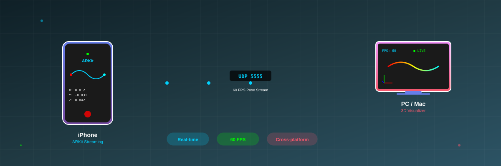

# ARPoseStreamer

<div align="center">


**一个轻量的 iPhone ARKit 位姿流采集与跨平台主机接收项目。**

**语言 / Language**: [English](README.md) | [简体中文](README.zh-CN.md)



</div>

---

## 项目简介

ARPoseStreamer 运行在 iPhone 上，使用 ARKit 输出相机 6-DoF 位姿，并通过 UDP 把紧凑格式的 pose 数据发到 macOS 或 Windows 主机。

这个仓库适合这些场景：

- 机器人与 ARKit 位姿采集
- 远程操作 / teleoperation
- 计算机视觉与 VIO 实验
- 快速搭建 iPhone-to-host pose pipeline
- 离线 CSV 标定与误差分析

## 主要功能

- iPhone 端 ARKit 6-DoF 位姿流
- macOS / Windows 端 Python 接收器
- 实时 3D 轨迹可视化
- 离线双流标定与验证
- 时间同步、尺度估计、hand-eye 标定
- 会话级 world 对齐与误差可视化
- scale 交叉验证风险量化

## 快速入口

- [英文主 README](README.md)
- [中文导览页](docs/README.zh-CN.md)
- [离线标定总览（中文）](docs/CALIBRATION_OVERVIEW.zh-CN.md)
- [Offline Calibration Overview (EN)](docs/CALIBRATION_OVERVIEW.en.md)
- [Setup Guide](docs/SETUP.md)
- [Architecture](docs/ARCHITECTURE.md)

## 离线标定这套流程做什么

当前离线流程会估计：

- `time_shift`
- `initial_scale_factor`
- `scale_factor`
- `T_cam2gripper`
- `T_base_world`
- relative / absolute / staged / cross-validation 误差

它的用途包括：

- 验证 ARKit 位姿与机器人真值的一致性
- 将 ARKit 相机位姿转换为机器人末端位姿
- 量化 hand-eye 自洽性
- 量化尺度过拟合风险

详细说明请看：

- [离线标定总览（中文）](docs/CALIBRATION_OVERVIEW.zh-CN.md)

## 离线标定命令示例

```powershell
python pose_tracking_validator.py --mode offline --arkit-csv "uploads\20260511-225434\pose_csv__pose.csv" --sensor-csv "uploads\end_effector_pose_log (1).csv" --output-dir offline_calibration_output
```

每次运行会在 `offline_calibration_output/` 下创建一个独立的时间戳子目录，里面包含：

- `offline_calibration_result.json`
- `velocity_time_alignment.png`
- `absolute_error_stages.png`
- `absolute_error_comparison.png`
- `axis_error_comparison.png`
- `scale_cross_validation.png`

## 关键提醒

- `T_cam2gripper` 是安装相关量，只有在手机装夹方式不变时才可复用。
- `T_base_world` 是会话相关量，ARKit world 变化后通常需要重新估计。
- 当前 `scale_factor` 是“几何一致性优化得到的有效尺度”，不是自动等于外部真值的绝对物理尺度。
- 当前 absolute error 默认是样本内重建误差；项目已经支持 block-wise cross-validation 用于量化过拟合风险。

## 说明

目前仓库主 README 仍以英文为主，这份中文 README 提供的是完整中文入口版本。若你需要更详细的原理、操作、限制与术语说明，请优先阅读：

- [离线标定总览（中文）](docs/CALIBRATION_OVERVIEW.zh-CN.md)

## 许可证

MIT
